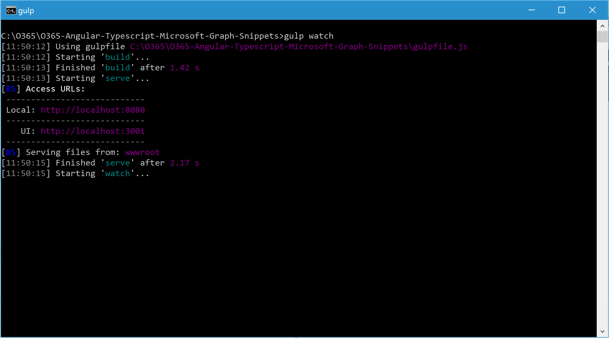
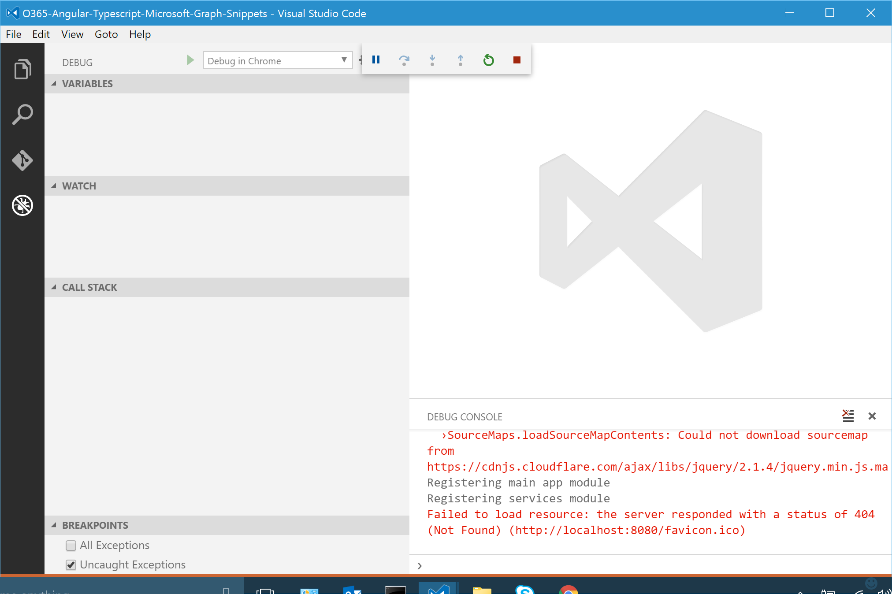

# O365-Angular-Typescript-Microsoft-Graph-Snippets

This is a TypeScript port of the Microsoft Graph snippets with Angular sample from the OfficeDev developer center on GitHub: https://github.com/microsoftgraph/angular-snippets-rest-sample

** Note **: You will need to register the sample with an Azure AD tenant which has an Office 365 subscription.  All of the instructions for obtaining test Azure and O365 subscriptions also apply to this sample.

## Building the Sample

You will need to have *npm* in your path, and both *bower* and *tsd* installed globally:

> npm install bower -g

> npm install tsd -g

After cloning the repository, run *npm install* from the root of the repository to restore Node dev-dependency packages.

Run *bower install* to restore client side JavaScript packages.

Run *tsd install* to restore TypeScript definition files.

## Running the Sample

Open a command prompt at the root of the repository and run *gulp watch*.  This launches the browser-sync static web server on port 8080 and watches for any changes to the TypeScript files.

You can change the server port in the gulpfile, but make make sure to use your port for Azure AD registration instructions below.

## Registering the Sample with Azure AD

Follow instructions from the [Microsoft Graph snippets with Angular](https://github.com/microsoftgraph/angular-snippets-rest-sample) sample to register the app with Azure AD and setup permissions for the Microsoft Graph.  Update the client ID in the *settings.ts* file in the *wwwroot/app* directory.

## Debugging in Chrome from VSCode

This sample is configured for debugging in Chrome with [VSCode](https://code.visualstudio.com/).  You will need to install the [Debugger for Chrome extension](https://marketplace.visualstudio.com/items?itemName=msjsdiag.debugger-for-chrome).

### You must launch Chrome with remote debugging enabled in order for the extension to attach to it.

+ Windows

  Right click the Chrome shortcut, and select properties
In the "target" field, append --remote-debugging-port=9222
Or in a command prompt, execute <path to chrome>/chrome.exe --remote-debugging-port=9222

+ OS X

  In a terminal, execute /Applications/Google\ Chrome.app/Contents/MacOS/Google\ Chrome --remote-debugging-port=9222

+ Linux

  In a terminal, launch google-chrome --remote-debugging-port=9222

To start debugging with Chrome, select the debug icon in the main menu on the left, then press the play button (green right triangle) with "Debug in Chrome" selected:

You should see output from console log messages in the Debug Console of VSCode, indicating that various Angular modules have been registered.

It is normal to see some error and warning messages from Chrome in the Debug Console.  However, if you receive any connection refused messages, make sure close all running instances of Chrome before trying to start debugging.

This sample uses JavaScript Sourcemaps, so you should be able to set breakpoints and do source line debugging in the TypeScript source.

